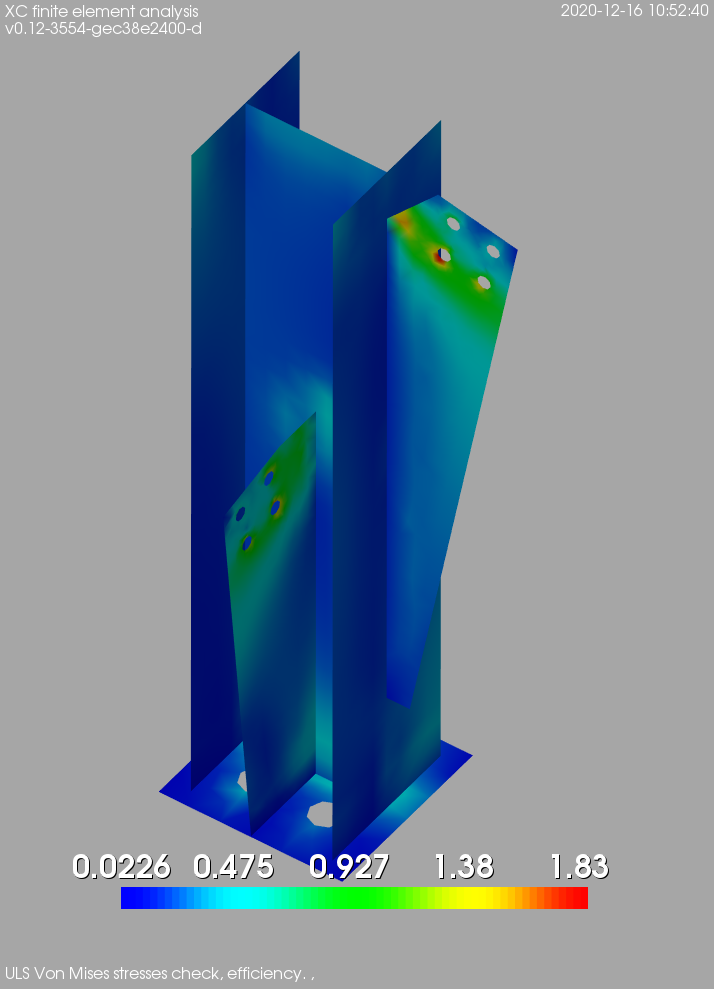

Open source finite element analysis program.
============================================

## Purpose
The purpose of XC is simple: **master the analysis software instead of being mastered by the analysis software**.

## Overview
You can see some screenshots <a href="https://github.com/xcfem/xc/tree/master/doc/screenshots" target="_new">here</a>.

The objective is to develop a robust structural analysis tool, which is owned by the community, and allows the users to improve and adapt it for their own needs. Open-source software (or, even better, free software) is the natural evolution of the tools structural engineers have been using forever.

It's all about developing tools that allow us to keep going forward (much in the sense of <a href="https://youtu.be/QhGUtJFl0HM" target="_new">designing for strength, economy and beauty</a>) instead of repeating the same old solutions but in a faster way.

## Features
The main capabilities of the program:

- Geometry modeling and mesh generation tools.
- OD, 1D, 2D and 3D elements.
- Linear and non-linear analysis, static and dynamic.
- Fiber section models (modelization of RC members,...).
- Activation an deactivation of elements (construction phases,...).
- Tools for implementing structural codes (in progress):
    - Reinforced concrete structures: Eurocode 2, ACI 318, EHE, SIA 262
	- Steel structures: Eurocode 3, AISC 360, EAE, SIA 263
	- Wood structures and masonry structures (in progress...).
- Interface with Industry Foundation Classes through <a href="http://ifcquery.com/" target="_new"> IFC++</a> (in progress...).
- Interface with SCIA Engineering (in progress...).
- Component-based finite element method (CBFEM) for analysis and design of steel conections (in progress...).

## Installation
See <a href="https://github.com/xcfem/xc/blob/master/install/install.md" target="_new">install</a>

You can also find <a href="https://hub.docker.com/repository/docker/antonsurv/xcfem" target="_new">Docker images</a> created by Anton Surviyanto. The source code of the Dockerfile is <a href="https://github.com/antonsurv/docker-antonsurv-xcfem" target="_new">here</a>

### Dependencies
Don't worry, if you have a decent *nix system the installation is straightforward. The program is based on:

 - [Python.](http://www.python.org/) 
 - [OpenSees.](http://opensees.berkeley.edu) 
 - [Visualization ToolKit (VTK).](http://www.vtk.org) 
 - [Boost c++ libraries.](http://www.boost.org) 
 - [Computational geometry algorithms library (CGAL).](http://www.cgal.org) 
 - [Gmsh.](https://gmsh.info) 
 - [NumPy.](http://www.numpy.org/) 
 - [SciPy.](http://www.scipy.org/) 
 - [LaTeX.](http://www.latex-project.org/) 
 - [Matplotlib.](http://matplotlib.org/) 
 - [libmpfr. Multiple precision floating-point computation developers tools (libmpfr).](http://www.mpfr.org/)
 - [libgmp. Multiple precision arithmetic library developers tools (libgmp).](https://gmplib.org/)
 - [Berkeley DB. Berkeley database libraries for C++ (libdb,libdb-dev).](https://code.launchpad.net/~bdb/berkeley-db/trunk)
 - [SQLite](https://www.sqlite.org/index.html)
 - [Arpack (Fortran77 subroutines to solve large scale eigenvalue problems; libarcpack2-dev).](http://www.caam.rice.edu/software/ARPACK/)
 - [Arpack++ (object-oriented version of the ARPACK package).](http://www.caam.rice.edu/software/ARPACK/)
 - [Lapack Library of linear algebra routines; (liblapack-dev).](http://http://www.netlib.org/lapack/)
 - [SuperLU (Direct solution of large, sparse systems of linear equations libsuperlu3-dev).](https://launchpad.net/ubuntu/+source/superlu)
 - [Suitesparse (collection of libraries for computations for sparse matrices).](http://faculty.cse.tamu.edu/davis/suitesparse.html)
 - [PETSC (Portable, Extensible Toolkit for Scientific Computation).](http://www.mcs.anl.gov/petsc/petsc-as)
 - [Skypack (SKYline PACKage).](http://crd-legacy.lbl.gov/~osni/#Software)
 - [ITPACK (collection of subroutines for solving large sparse linear systems by adaptive accelerated iterative algorithms).](http://rene.ma.utexas.edu/CNA/ITPACK/)
- [Open Graphics Library](https://en.wikipedia.org/wiki/OpenGL)
- [X Window System](https://en.wikipedia.org/wiki/X_Window_System)

## Where to start
The programs lacks of a user manual (would you help us with that?). Anyway you can start with some simple examples you'll find <a href= "https://github.com/xcfem/xc_examples" target="_new"> here</a>. You can also take a look [here](https://github.com/xcfem/xc/blob/master/doc/how_to_start.md)

## Links
You can take a look to the project <a href="https://sites.google.com/site/xcfemanalysis/" target="_new">home</a>, to the <a href="https://xcfem.github.io/XCmanual/" target="_new">Python documentation</a> or the <a href="https://codedocs.xyz/xcfem/xc/index.html" target="_new">C++ API documentation</a> or to our <a href="http://www.xcengineering.xyz/html_files/software.html" target="_new"> XC page in the company site.</a> (all of them are work in progress ;-). 

<!--  LocalWords:  XC
 -->
